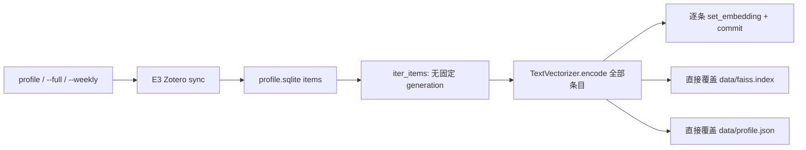
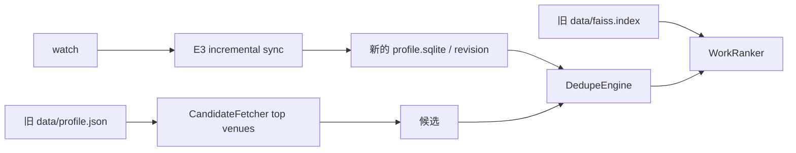
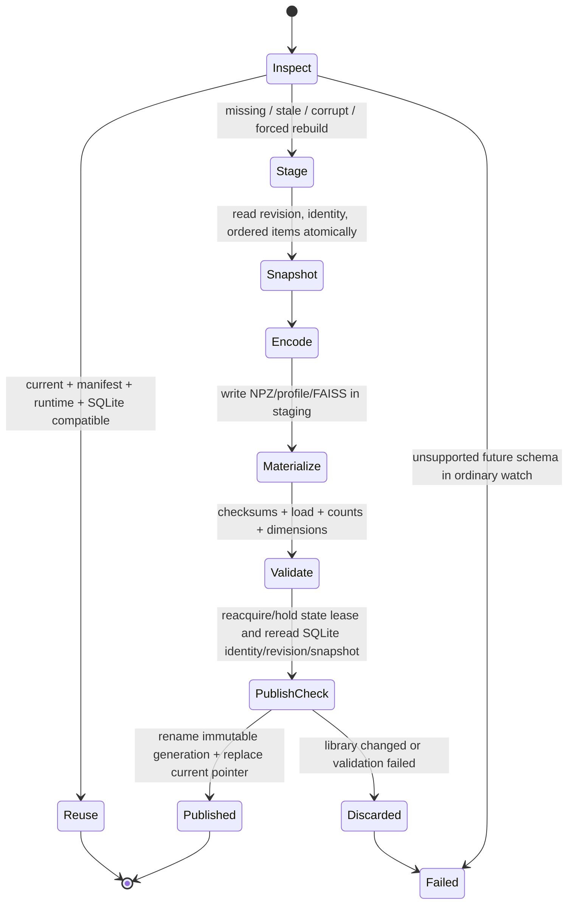

# E4 — Computational State Consistency Implementation Plan

日期：2026-09-11

状态：**plan only；等待审阅，尚未修改 production code。**

起点：`v2-e3-baseline` / `8ceec503f81f701ead156c5695b3d115b1cac537`。

## 1. Scope 与目标

E4 只建立 engine 端可重建计算状态的一致性、验证、原子发布和恢复边界。目标 invariant 是：任何进入 personalized ranking 的 profile、embedding 集合和 FAISS index，都属于一个已完整发布的 generation，并且与本次运行读取的 SQLite mirror、Zotero library identity、committed library revision、embedding runtime 和相关 profile 配置完全兼容。

E4 首版选择 correctness-first 的全量 profile/index rebuild。它不实现 incremental embedding/index update，也不实现 GitHub artifact/cache transport。状态不兼容时，受支持的 `profile`/`watch` 流程重建完整 generation；低层 ranker 没有同步和构建上下文时明确失败，绝不回退到旧文件。

继续保持状态三分法：

1. **Git config**：`zotwatch.yaml` 及 legacy config，非敏感、可 commit。
2. **Rebuildable computational state**：`profile.sqlite`、embedding generation、FAISS、`profile.json`、manifest 和 current pointer；不 commit，丢失后可从 Zotero/已提交 SQLite mirror 重建。
3. **Durable user feedback**：E4 不创建、不迁移、不读写；不得放入 computational generation 或 SQLite embedding cache。

本计划不改变 ranking 公式、候选 API、RSS/HTML 内容、Zotero 网络同步语义、AI、clustering、durable feedback、harvester、Cloudflare、workspace-template 或 reusable workflow。

## 2. 当前 computational-state data flow

当前 `profile` 路径：



当前 `watch` 路径：



实际边界如下：

- `ProfileStorage.metadata.last_modified_version` 已由 E3 定义为成功提交的 Zotero revision，但 profile/FAISS 没有记录或验证它。
- `ProfileBuilder.run()` 先把每条 embedding 单独写入 SQLite 并逐条 commit，再直接写 `faiss.index` 和 `profile.json`。三者没有共同 transaction/generation；任一步失败都可能留下混合产物。
- `WorkRanker` 仅依据固定路径存在并可解析来加载状态，不校验 library revision、library identity、model、dimension、配置或文件完整性。
- `CandidateFetcher` 在 `watch` 的 state validation/ranker construction 之前读取固定的 `data/profile.json`，用其中 top venues 发起补充查询。
- `TextVectorizer.model_name` 是唯一模型元数据。当前 profile JSON 虽记录 model name，消费者不检查它，也没有实际模型 revision/fingerprint。
- `items.content_hash` 覆盖 title/abstract/creators/tags，但当前 hash 没有字段边界；`items.embedding` 没有 model、dimension、input schema 或 generation 标识。
- FAISS 文件没有 companion manifest；profile JSON 与 index 之间也没有 checksum/count/dimension 关联。
- 原 daily workflow 的月度 cache 只判断 key 命中，恢复顶层 SQLite/FAISS/profile 文件；cache 命中不证明三者属于同一 revision。

## 3. 已确认 stale/mixed-state bugs

| ID | 触发条件 | 当前结果 | E4 预期 |
| --- | --- | --- | --- |
| E4-BUG-W1 | `watch` 成功同步 add/modify/delete/trash/restore | dedupe 使用新 SQLite，ranking 与 top-venue supplement 使用旧 profile/FAISS | 同步后先 ensure compatible generation；不兼容则完整重建或失败 |
| E4-BUG-I4 | 影响 embedding input 的 item 内容改变 | E3 upsert 保留旧 embedding BLOB，旧 FAISS 仍可加载 | generation input fingerprint/revision 变化；旧 generation 拒绝，全部向量重算 |
| E4-BUG-A1 | 构建在写 embedding、index、profile 的任一步中断 | 部分 SQLite embedding 或一新一旧的顶层文件可见 | staging 不可见；current pointer 不变 |
| E4-BUG-A2 | model name、weights/revision 或输出 dimension 改变 | 旧 index 仍被加载；搜索时可能错误或晚失败 | descriptor/fingerprint/dimension 不匹配即拒绝并重建 |
| E4-BUG-A3 | profile JSON、FAISS 损坏或缺一个文件 | 分别在 JSON/FAISS loader 中偶然失败，没有统一恢复 | manifest/checksum/结构验证失败；CLI 重建，低层 ranker fail closed |
| E4-BUG-A4 | engine/profile input rules/config 改变 | file-exists/monthly-cache 仍视为有效 | engine/state ABI 和 relevant-config fingerprint 决定失效 |
| E4-BUG-A5 | 构建期间另一个进程提交新 library revision | 新文件可能声明不了稳定输入，或与最新 SQLite 混用 | 从一个 SQLite snapshot 构建，publish 前复核；变化则丢弃 staging |
| E4-BUG-A6 | workspace 切换 Zotero user 但复用 state path | revision 数字和旧 rows 可能被误当成新 library | SQLite 与 manifest 都绑定 pseudonymous identity fingerprint；缺失/变化先 full sync |

这些是 E4 intentional correctness changes。原 E0 profile/ranking/RSS/HTML golden 内容继续保持；不会用批量重录 expected behavior 掩盖变化。

## 4. State invariant

一个 `CurrentState` 只有在以下条件全部成立时才可用于 ranking：

```text
pointer -> one immutable generation
generation.manifest is supported and structurally valid
manifest.library.identity == storage.library_identity
manifest.library.revision == storage.last_modified_version
manifest.library.snapshot_fingerprint == current SQLite profile-input fingerprint
manifest.embedding descriptor/fingerprint/dimension == current runtime
manifest.profile.config_fingerprint == current effective profile config
manifest.engine/state ABI is compatible with this engine
manifest artifact hashes/counts/dimensions match actual files
FAISS can be loaded and agrees with embedding/profile metadata
```

“当前”由一个小型原子 pointer 唯一决定，不由目录 mtime、文件存在、最新目录名或 Actions cache hit 决定。旧 generation 即使文件完整，只要与当前 SQLite revision 不一致，就只能保留作诊断/回滚，不能参与 ranking。

SQLite 的 `last_modified_version` 与新增的 `library_identity_sha256` 都是 mirror identity 的一部分。E4 不把 raw Zotero user ID 写入 manifest；identity 使用 canonical library type + library ID 的 SHA-256，称为 **pseudonymous identity fingerprint**。它降低直接暴露，不声称提供匿名化；能获知候选 user ID 的主体仍可重算 fingerprint。新增 metadata key 不改变 E3 tables，旧 SQLite 可原样打开。

## 5. Local state layout

首版采用 immutable generation directory + atomic JSON pointer：

```text
<state>/
  profile.sqlite
  cache/
    candidate_cache.json
  computational/
    current.json
    generations/
      <generation-id>/
        profile.json
        embeddings.npz
        faiss.index
        state-manifest.json
    staging/
      <run-id>.tmp/
        ...
  .zotwatch-state.lock
```

设计决定：

- `profile.sqlite` 继续是 E3 mirror 与 committed revision 的本地 authority；E4 不复制或替换它。
- `embeddings.npz` 保存这一代按稳定 item-key 顺序排列的 float32 vectors 与 keys；FAISS 和 profile summary 必须由同一内存矩阵生成。它是可重建状态，不是新的 durable data store。
- generation 发布后不可修改。`current.json` 只保存相对 `generation_id` 与 manifest SHA-256，不出现 absolute path、credential 或用户内容。
- ranking 读取 pointer 一次并持有 immutable `StateHandle`，不会在一次调用中跨 generation 重新解析路径。
- 顶层 legacy `profile.json`/`faiss.index` 不再是 engine authority。E4 不删除它们，以便 code rollback/诊断；E4 ranker 绝不从它们 silent fallback。
- 当前 daily workflow 的旧 cache path 在 E4 不改。命中 legacy files 不能满足新 manifest，因此 engine 会重建；性能和 GitHub state transport 留给 P2。
- `.gitignore` 明确覆盖默认路径的 `computational/`、lock 和所有 SQLite/index/vector artifacts。自定义 state path 的所有者仍须在其 workspace/template 设置等价 ignore；模板修改不属于 E4。

使用 JSON pointer 而不是依赖 symlink 或替换非空 `current/` 目录，便于跨平台实现单文件 `os.replace()`。所有 staging/final/pointer 文件位于同一 state filesystem。

## 6. Manifest schema proposal

`state-manifest.json` v1 建议结构：

```json
{
  "schema_version": 1,
  "state_compatibility_version": 1,
  "generation": {
    "id": "132-7f9c2a1b-<random>",
    "run_id": "<opaque-id>",
    "created_at": "2026-09-11T00:00:00Z"
  },
  "engine": {
    "version": "2.0.0.dev1",
    "profile_builder_abi": 1
  },
  "library": {
    "identity_sha256": "<hex>",
    "revision": 132,
    "snapshot_sha256": "<hex>",
    "item_count": 2451
  },
  "embedding": {
    "provider": "local",
    "model_identifier": "sentence-transformers/all-MiniLM-L6-v2",
    "model_revision": "<resolved revision or null>",
    "model_fingerprint_sha256": "<hex>",
    "input_schema": "zotero-item-embedding-v1",
    "normalization": "l2-float32-v1",
    "input_set_sha256": "<hex>",
    "dimension": 384,
    "artifact": "embeddings.npz",
    "artifact_sha256": "<hex>"
  },
  "profile": {
    "schema_version": 1,
    "config_sha256": "<hex>",
    "aggregation": "mean-l2-v1",
    "artifact": "profile.json",
    "artifact_sha256": "<hex>"
  },
  "index": {
    "format": "faiss",
    "format_version": 1,
    "factory": "IndexFlatIP",
    "metric": "inner-product",
    "artifact": "faiss.index",
    "artifact_sha256": "<hex>",
    "dimension": 384,
    "ntotal": 2451
  }
}
```

Compatibility fields：

- exact supported `schema_version` 与 `state_compatibility_version`；
- `profile_builder_abi`；完整 `engine.version` 记录用于审计，不作为长期 hard compatibility identity；
- library identity、committed revision、snapshot fingerprint、item count；
- embedding provider/model identifier/revision/fingerprint、input schema、normalization、input-set fingerprint、dimension；
- profile schema/config fingerprint/aggregation；
- index format/factory/metric/count/dimension；
- 所有 artifact 相对路径与 SHA-256。

Informational fields：generation ID、run ID、timestamp、完整 engine version。它们用于审计和诊断，不参与 reuse 判定。manifest 不包含 Zotero raw ID、item title/abstract、API endpoint/key、environment/Secret name、workspace absolute path 或 durable feedback。

处理规则：

- manifest/current pointer 缺失、JSON 损坏、字段缺失、旧/unversioned state：标记 invalid；受支持 CLI 自动 rebuild。
- artifact 缺失、checksum/load/count/dimension 不匹配：标记 corrupt；不加载旧 index，自动 rebuild。
- manifest schema 比当前更旧且没有显式 migrator：rebuild，不做 best-effort interpretation。
- manifest schema 比当前更新：绝不加载。普通 `watch` fail closed，避免旧 engine 覆盖新格式；显式 `profile --full` 可在保留未来 generation 的前提下建立一个本 engine generation 并切换 pointer。
- 没有扫描目录并猜测“最新可用 generation”的自动恢复。pointer 损坏时重建；手工 repoint/repair 工具不在 E4。

## 7. Fingerprint definitions

所有 fingerprint 输入使用版本化 canonical JSON：UTF-8、排序 key、明确数组顺序、无机器路径和 secret。YAML 格式、注释或无关字段变化不会导致失效。

### 7.1 Library identity 与 snapshot

- `library_identity_sha256 = sha256(canonical({source: "zotero", library_type, library_id}))`。首版仍是 user library；manifest 不写 raw user ID。它是 pseudonymous identity fingerprint，不是匿名身份。
- E4 向 SQLite metadata 增加同名 identity。旧 DB 缺少 identity 或 identity 与当前凭据不一致时，不能只“认领”旧 rows；下一次 `profile`/`watch` 先执行 E3 full sync，并在 rows/watermark 的同一 atomic apply 中写入 identity。
- `snapshot_sha256` 对稳定按 item key 排序的 profile inputs 计算，包括 key、Zotero item version、embedding input fingerprint，以及影响 profile summary 的 venue。它不读取或信任旧 embedding BLOB。
- snapshot 与 revision 在同一个 SQLite read transaction 中采集。revision 缺失/非法时不能构建；交由 E3 initial/full recovery。

### 7.2 Embedding input validity 与 BUG-I4

定义 `zotero-item-embedding-v1`，精确对应当前 `ZoteroItem.content_for_embedding()` 的 title、abstract、creators 和 tags 及其结构边界。per-item fingerprint 使用 canonical structured fields，不沿用当前无字段分隔的 hash 拼接作为唯一 validity proof。

E4 首版每次 generation rebuild 都重算全部 active items，不从 `items.embedding` 复用向量。因此 add/modify/delete/trash/restore、模型或 relevant config 变化都不会把旧 BLOB 当成有效向量。现有 `items.embedding` column 保留以维持 SQLite schema/code rollback compatibility，但降级为 non-authoritative legacy cache；E4 state validation 和 ranker不读取它。是否在成功 publication 后批量更新该 cache 只属于兼容投影，失败不能影响 generation validity。

### 7.3 Model revision/fingerprint

新增只面向本地 `TextVectorizer` 的 `EmbeddingRuntimeDescriptor`；这不是 AI provider adapter。descriptor 至少提供：provider、requested model identifier、可解析时的 upstream revision、engine normalization/input-schema version，以及 required runtime fingerprint。

Hard model identity 优先由稳定、离线可重现的 descriptor 组成：provider、requested model identifier、可用时的 resolved immutable upstream revision/commit、稳定的 model artifact/config identity、embedding input schema、normalization version 与 profile builder ABI。无法取得 upstream revision 时 `model_revision` 可为 null，但必须有稳定 artifact/config identity；不能用 runner-specific runtime package version 或 raw floating output替代模型身份。

固定 engine-owned probe texts 可以保留为 diagnostic metadata，但 raw normalized float32 bytes 的 SHA-256 不属于 hard compatibility。若实现时需要把 probe 纳入兼容 fingerprint，必须先定义带版本号的量化规则（固定 dtype、rounding mode、decimal precision、shape/order），只 hash量化后的 canonical representation；首版优先完全排除 probe diagnostic。测试 vectorizer显式提供固定 descriptor，不访问网络。

输出 dimension 从实际 vector matrix 取得并与 descriptor probe、NPZ、profile centroid 和 FAISS `d` 交叉验证。候选 encode 的 dimension 在 ranking 时也必须等于 manifest dimension。

### 7.4 Relevant config

`profile.config_sha256` 只覆盖会改变 profile/index 的 resolved effective values：

- item selection policy 与 embedding input schema；
- embedding provider/model selection；
- normalization；
- centroid aggregation；
- top-author/top-venue summary rules与数量；
- FAISS factory/metric。

ranking weights、thresholds、candidate sources/window、output formats、AI routes 和 YAML formatting 不属于 profile fingerprint；它们改变运行时其他阶段，但不改变这组 vectors/profile/index。测试同时覆盖 relevant change 必须 rebuild、irrelevant ranking-only change 可以 reuse。E2 v2 config 仍只做既有 offline validation；E4 不借此把 v2 配置接入完整 production pipeline。

## 8. Generation lifecycle 与 state machine



具体边界：

1. `StateManager.inspect()` 解析 pointer/manifest，并与当前 storage/runtime/config 比较，返回 typed reason；它不把 invalid state 加载给 ranker。
2. `ProfileStorage.read_profile_snapshot()` 在一个 SQLite read transaction 中读取 identity、revision 和稳定排序的 active items，然后结束 transaction；不在长时间 model encode 期间持有 DB transaction。
3. vectors、NPZ、profile JSON 和 FAISS 全部写到 `<state>/computational/staging/<run-id>.tmp`。manifest 最后写。
4. staging validation 重新读取 NPZ/JSON/manifest，加载 FAISS，并核对 hashes、item count、keys、dimension、centroid shape、index type/metric/ntotal。
5. publish 前再次读取 live SQLite identity/revision/snapshot。任何变化都删除/遗留为不可见 staging，current pointer 不动，并以 retryable state-changed error 结束；下一次从新 revision 重建。
6. validated staging 在同一 filesystem rename 为唯一 `generations/<generation-id>`。随后把完整 `current.json.tmp` fsync 并以 `os.replace()` 原子替换 pointer；必要目录也 fsync。
7. pointer 替换前的异常保留上一 pointer。rename 后、pointer 前中断只产生 unreferenced完整 generation；它不会被自动选中。pointer 替换后 generation 已不可变且完整。

E4 增加 `<state>/.zotwatch-state.lock` 的跨进程 advisory lease。**lease ownership 由调用边界显式决定：** official `profile`/`watch` coordinator 在一次 run 中 acquire 一次，并把同一个 `StateLease` capability/参数传给 ingestor、StateManager、ProfileBuilder、CandidateFetcher 与 WorkRanker。低层方法看到有效 lease 时只验证 ownership/state root，不再次 acquire。

official `watch` 的唯一 ownership 顺序是 `acquire -> E3 sync -> ensure/build -> CandidateFetcher -> dedupe -> rank(same StateHandle) -> release`；`profile` 是 `acquire -> E3 sync -> ensure/build -> release`。standalone StateManager/ProfileBuilder/WorkRanker 若未收到 coordinator lease，可以在自己的公开操作边界 acquire一个短生命周期 lease并在返回前释放；内部 helper不能偷偷嵌套 acquire。测试用 non-reentrant fake lock 证明 official path只 acquire一次，避免依赖某个 file-lock库的递归行为。

StateManager 即使收到已持有 lease仍执行 publish-time revision/snapshot复核，以防直接 SQLite writer或低层 API绕过 coordinator。锁文件不承载状态，进程退出后 OS lock自动释放。

首版不自动删除历史 generation；中断 staging 和 unreferenced generation 可在持锁时安全识别，默认只清理明确的 `.tmp` staging。generation retention/GC policy 可后续加入，避免删除仍被一个低层 `StateHandle` 使用的 immutable files。

## 9. Invalidation matrix

| 变化 | E4 首版动作 | 理由 / 未来优化 |
| --- | --- | --- |
| 首次 profile，无 current manifest | full generation build | 没有可验证 state |
| committed revision 与所有 fingerprints 不变 | reuse | 完整 validation 通过 |
| Zotero item added | full rebuild | revision/snapshot/item count 变化；未来可 incremental |
| title/abstract/creators/relevant tags modified | full rebuild | embedding input fingerprint 变化，解决 BUG-I4 |
| venue/profile-summary input modified | full rebuild | snapshot/profile summary 变化 |
| item deleted / moved to trash | full rebuild | active set、count 和 index 变化 |
| item restored | full rebuild | active set、count 和 index 变化 |
| unrelated Zotero raw field changed且 revision 前进 | full rebuild | E4 首版以 committed revision 为硬边界；未来可证明安全后细化 |
| embedding model identifier changed | full rebuild | vector space 变化 |
| model revision/runtime fingerprint changed | full rebuild | 相同名称也不能复用旧 vectors |
| embedding dimension changed | reject current + full rebuild | index/query shape 不兼容 |
| relevant profile config/input schema/normalization/index metric changed | full rebuild | computational semantics 变化 |
| ranking-only weight/threshold changed | reuse | 不改变 profile/index；ranker仍使用新 runtime weights |
| state/profile/index schema 或 builder ABI changed | full rebuild | 无显式 migrator时不解释旧格式 |
| engine version changed，ABI/schema/semantic fingerprints不变 | reuse | 完整版本只供审计；hard compatibility由显式 ABI/schema/fingerprints决定 |
| engine upgrade改变 ABI/schema/semantic fingerprint | full rebuild | 变化由对应兼容字段表达，不依赖版本字符串猜测 |
| generation timestamp/run ID changed | no invalidation | informational only |

## 10. Atomic publication 与 SQLite boundary

E4 不尝试把 SQLite transaction 和 filesystem rename 伪装成一个跨资源 ACID transaction。采用简单、可证明的顺序：

- E3 先原子提交 mirror rows + library identity + revision；
- E4 从该 committed state 读取一致 snapshot；
- 所有大文件离线写入 staging；
- 在 state lease 下复核 live SQLite；
- 只发布一个已验证 immutable generation；
- 最后原子切换单个 pointer。

因此任何时刻 current pointer 要么指向上一份完整 generation，要么指向新完整 generation。若 SQLite 已前进而 rebuild 失败，上一份 generation 仍保留，但 validation 会判定 stale，`watch` 不得继续 ranking。

SQLite 改动限于：

- 新增 metadata key `library_identity_sha256`，在成功 full/incremental sync 的 atomic apply 中与 revision 同步提交；
- 新增一致 snapshot read helper；
- 现有 schema/table/rows 无 destructive migration；
- legacy embedding column 保留且不作为 E4 reuse authority。

## 11. `profile` / `watch` / ranker integration

统一规则：

### `profile`

- 默认：E3 incremental sync，然后 inspect current state；完全兼容则 reuse，否则 full computational rebuild。
- `--full`：保持其 Zotero full-sync 语义，并强制生成一个新 computational generation，即使现有 state 兼容。
- `--weekly`：继续是 `--full` alias，行为与旧入口一致。
- 无 item 的 library 继续明确失败为无可构建 profile，不创建空 FAISS/pseudo-valid manifest。

### `watch`

1. 在 state lease 下运行 E3 incremental sync。
2. 读取本轮 committed revision/identity。
3. `StateManager.ensure_current()`；missing/stale/corrupt 自动 full computational rebuild。
4. 将 validated `StateHandle.profile` 传给 `CandidateFetcher`，不让 engine watch path从 legacy 顶层 profile 猜 top venues。
5. 同一 lease 内用相同 SQLite revision做 dedupe，并将同一 `StateHandle` 传给 `WorkRanker`。
6. rank 完成后才释放 lease；后续 writer/output/push 使用已算出的结果。

若 rebuild、manifest validation 或 publish 失败，`watch` 返回非零并保留上一输出/上一 generation；不产生基于 stale profile 的新 ranking/report。E5 才定义统一 run manifest/退出码，本阶段沿用现有异常传播。

### WorkRanker / CandidateFetcher

- 新主路径要求 `StateHandle`。WorkRanker 在搜索前再次校验 candidate vector dimension 和 index metadata。
- 为兼容已有 Python constructor，未显式传 handle 时可通过 state root + `profile.sqlite` 解析并验证 current state；invalid 时抛出明确 `StateCompatibilityError`，不能加载顶层旧 files。
- CandidateFetcher 增加 validated profile summary/path 注入；standalone legacy constructor 可以保留旧 top-venue读取行为，但 `run_watch` 必须使用 handle 注入。
- scoring、排序、filter、RSS/HTML writer 代码不改变；相同 fixed vectors 与 input 仍产生原 E0 ranking/output goldens。

## 12. Recovery semantics

| 故障 | 自动/显式处理 | 旧 good generation |
| --- | --- | --- |
| current/manifest missing or corrupt | profile/watch rebuild；ranker alone fail closed | 保留，但不扫描猜测 |
| FAISS/profile/NPZ missing | checksum/structure validation 拒绝并 rebuild | 保留其他 generation |
| FAISS unreadable/index type错误 | rebuild | 当前损坏 generation 不加载 |
| dimension/count/key/hash mismatch | rebuild | 不 best-effort 搜索 |
| stale library revision/identity/snapshot | rebuild from committed SQLite | 完整但不可 ranking |
| model/config/engine fingerprint changed | rebuild | 完整但 incompatible |
| vectorize/profile/index generation失败 | staging 不发布 | pointer不变 |
| process在 generation rename 前中断 | `.tmp` staging ignored/可清理 | pointer不变 |
| process在 generation rename 后、pointer前中断 | unreferenced immutable generation ignored | pointer不变 |
| library revision在 build期间改变 | final check失败，staging丢弃 | pointer不变且 stale，不可 ranking |
| current pointer已切换 | 所有 artifacts 已验证且 immutable | 新 generation 可用 |
| future manifest schema | watch/low-level ranker fail closed；显式 full profile可另建当前版本 generation | future generation不删除 |

用户可安全删除整个 `computational/` 后重新运行 `profile`；只要 `profile.sqlite` 有合法 E3 committed revision，就不必重新授权 Zotero。删除 SQLite 时下一次 E3 initial sync 会从 Zotero 建立 mirror。E4 不提供修补损坏 FAISS 的原地工具。

## 13. Backward compatibility

必须保持：

- `ZOTERO_API_KEY`、`ZOTERO_USER_ID` 和当前授权；不要求 OAuth/重新授权。
- `zotwatch profile|watch` 与 `python -m src.cli profile|watch`，以及现有 flags。
- E3 SQLite tables、items 和 `metadata.last_modified_version`；新增 metadata key 对 E3 代码无害。
- existing DB 可直接读取；identity 缺失/变化时以一次失败安全的 full sync 建立身份，不覆盖旧配置。
- ranking/scoring/RSS/HTML 算法和 E0 golden 文件内容。
- E1 独立 workspace、state/reports path 与 installed wheel/editable behavior。
- E2 schema/provider/config validate 行为。

明确的 intentional changes：

- `watch` 在 SQLite revision 改变后会 rebuild profile，而不再重现 BUG-W1；构建失败时整次 watch 失败。
- legacy/unversioned top-level FAISS/profile 不再直接供 ranker 使用；首次 E4 run 重建。
- `profile` 默认在状态完全兼容时可 reuse，不再无条件重算；`--full` 仍强制重建。
- `items.embedding` 不再是 state validity 证据；旧值不会被 ranker/StateManager消费。
- 内部 artifact path 移至 immutable generation。`ProfileArtifacts` 保留原字段名但返回当前 generation 的实际路径，并增加 generation/manifest 信息；CLI surface不变。

E0 fixtures/goldens 不修改。依赖固定顶层 state 文件路径的测试改为通过 returned artifacts/StateHandle 定位同内容文件，并另加 legacy-state rejection case。

## 14. Expected modified files

计划批准后的 production files：

- `src/computational_state.py`（新）：manifest/pointer models、fingerprints、StateManager/StateHandle、validation、staging/publish、typed errors、state lease。
- `src/build_profile.py`：从一致 snapshot 生成一组 staged artifacts；不直接覆盖 current files。
- `src/vectorizer.py`：local embedding runtime descriptor/fingerprint；不增加网络 provider adapter。
- `src/faiss_store.py`：index metadata/validation helpers；搜索算法不变。
- `src/storage.py`：library identity metadata、consistent profile snapshot 和 E3-compatible atomic apply扩展。
- `src/ingest_zotero_api.py`：只把固定 library identity传入 atomic apply；不改 E3 HTTP/revision/trash semantics。
- `src/models.py`：扩展 `ProfileArtifacts`/snapshot或state dataclasses，保留现有字段。
- `src/cli.py`：profile/watch统一 ensure规则与 run-level state lease。
- `src/fetch_new.py`：允许注入 validated profile summary/path；候选网络/API/cache语义不变。
- `src/score_rank.py`：只从 validated StateHandle加载 profile/index并校验 query dimension；scoring函数不变。
- `zotwatch/__init__.py` 或独立版本 helper：稳定取得 installed engine version。
- `pyproject.toml`：若采用 `filelock`，将其列为显式 runtime dependency，不能依赖 sentence-transformers 的传递依赖。
- `.gitignore`：新增 computational state默认路径忽略规则。

Test/docs：

- `tests/test_computational_state_e4.py`（新）：manifest/fingerprint/lifecycle/invalidation/recovery/atomic publication。
- `tests/test_pipeline_http.py`：将 BUG-W1 observation 替换为 E4 correctness case；HTTP fixtures不改 E3语义。
- `tests/test_ingestion_dedupe.py`：将 BUG-I4 observation替换为 generation invalidation regression。
- `tests/test_profile_ranking_outputs.py`：通过 generation artifacts比较原 golden，并保护 scoring结果。
- `tests/test_paths.py`、`tests/test_installation.py`、`tests/installed_probe.py`、`tests/test_resources.py`：验证外部 state layout与 installed engine，原 E0 goldens不变。
- `tests/test_zotero_sync_e3.py`：仅在新增 identity metadata需要扩展 assertions；既有 E3 cases/语义保持。
- `tests/fixtures/state-e4/`（新，如需要）：只放合成 manifest/corruption samples，不修改 E0 fixtures。
- `tests/E4_RED_BASELINE.md`、`tests/README.md`：记录 E3 baseline 的预期 red evidence 和 intentional fixes。
- `docs/E4_COMPUTATIONAL_STATE.md`（新）：最终 manifest/layout/recovery/release note。
- `.github/workflows/characterization.yml`、`.github/workflows/packaging.yml`：最多增加 E4 branch触发/静态 gate；不修改 daily workflow或实现 reusable workflow。

预计不修改 `tests/goldens/`、`zotwatch/config/`、`zotwatch/providers/`、candidate public connection、ranking formulas、writers、harvester、web 或 template。

## 15. Regression test matrix

| Case | Setup / fault injection | Required assertion |
| --- | --- | --- |
| E4-STATE-001 first build | E3 DB有 identity/revision/items，无 current | 完整 generation发布；manifest/NPZ/profile/FAISS一致 |
| E4-STATE-002 unchanged reuse | 同 identity/revision/model/config再次 ensure | 不调用 encode、不产生新 generation |
| E4-STATE-003 item added | revision/item set前进 | old拒绝；full rebuild；count/index增加 |
| E4-STATE-004 embedding content modified | title/abstract/creator/tag改变 | input fingerprint变；全部 embeddings/profile重建；BUG-I4关闭 |
| E4-STATE-005 item deleted/trash | active row被 E3移除 | old拒绝；新 NPZ/index/profile不含 item |
| E4-STATE-006 item restored | active row重新进入 | old拒绝；新 generation包含 item |
| E4-STATE-007 model fingerprint | 同 model name，不同 runtime fingerprint | rebuild |
| E4-STATE-008 model identifier | configured identifier改变 | rebuild |
| E4-STATE-009 dimension | runtime/NPZ/manifest/index任一 dimension不匹配 | reject；CLI rebuild；ranker不搜索 |
| E4-STATE-010 relevant config | input schema/aggregation/index metric fingerprint改变 | rebuild |
| E4-STATE-011 irrelevant config | 仅 ranking weight/threshold改变 | state reuse；ranking使用新 weight |
| E4-STATE-012 missing/corrupt FAISS | 删除、截断或非法 index | validation失败，previous不被误用，rebuild |
| E4-STATE-013 missing/corrupt manifest/pointer | 删除/非法 JSON/checksum | rebuild；不目录猜测 |
| E4-STATE-014 future schema | manifest version大于支持值 | ordinary watch/ranker fail closed；显式 full可重建且保留未来目录 |
| E4-STATE-015 generation failure | vectorizer/profile/FAISS save抛错 | pointer未变；staging不可见；previous good保留 |
| E4-STATE-016 interruption before publish | 在artifact写入、validate、rename前后注入中断 | current永不指向partial generation |
| E4-STATE-017 revision changes mid-build | snapshot R 后第二连接提交 R+1 | publish check拒绝；新 pointer不发布 |
| E4-STATE-018 previous stale good | SQLite已到 R+1，R generation完整，R+1 build失败 | R files/pointer保留但 ranking明确拒绝 |
| E4-STATE-019 ranker mismatch | 手工把 pointer/manifest revision改为不同值 | WorkRanker在encode/search前失败 |
| E4-STATE-020 library identity | 缺失或另一个 user identity | 不采用旧 rows；full sync后绑定新 identity |
| E4-STATE-021 profile/watch flags | default、`--full`、`--weekly`、watch | reuse/force/ensure规则与计划一致 |
| E4-STATE-022 legacy artifacts | 只有顶层 `profile.json`/`faiss.index` | 不加载；构建 versioned generation |
| E4-STATE-023 E3 compatibility | 现有 E3 SQLite fixture/db | 无 destructive migration；全部 E3 regressions通过 |
| E4-STATE-024 installed paths | wheel/editable + checkout外 workspace/state | generation全部写 external state；engine package不被写入 |
| E4-STATE-025 golden behavior | fixed E0 vectors/items/candidates | profile/ranking/RSS/HTML内容 goldens不变 |

并发测试至少用两个 SQLite connections 加 barrier：一个 generation停在 encode/validate 后，另一个模拟 revision commit，确认最终 compare-and-publish 拒绝。filesystem failure tests monkeypatch write/fsync/rename/replace，不依赖真实进程 kill。

## 16. Commit / PR boundaries

当前只提交本计划：

0. `docs: plan E4 computational state consistency`：仅 `E4_IMPLEMENTATION_PLAN.md`。

计划批准后建议保持以下独立 commits：

1. `test(state): define E4 consistency regressions`：先加最小 failing tests；在未改 production 的 `v2-e3-baseline` 记录 red evidence，不改 E0 goldens。
2. `feat(state): add versioned manifests and compatibility validation`：models、canonical fingerprints、runtime descriptor、StateManager inspect/StateHandle；先覆盖 pure unit tests。
3. `feat(state): publish profile generations atomically`：SQLite snapshot/identity、staging artifacts、validation、rename/pointer publication和 failure injection tests。
4. `fix(pipeline): require current computational state for watch and ranking`：profile/watch/fetcher/ranker integration，关闭 BUG-W1/BUG-I4；scoring/candidate semantics不改。
5. `test(state): seal E4 recovery and installation gates`：installed/path tests、release note、README/CI branch gate和最终 evidence。

每个 commit 单独运行 focused tests；最终 PR 运行两遍 E0 characterization、E1 installed wheel/editable、E2 config/provider、E3 sync regression 与全部 E4 tests。PR diff 审查必须证明 E0 goldens、ranking functions、candidate public API paths和 E3 HTTP/revision state machine未发生无关变化。

## 17. Rollback strategy

E4 不做 destructive DB migration。新增 SQLite metadata key 会被 E3忽略，现有 tables/rows仍可读；新 `computational/` generations 也会被 E3忽略。

回退 engine 到 `v2-e3-baseline` 时：

1. 保留 `profile.sqlite` 供诊断/继续同步；E3可忽略 library identity metadata。
2. E4不删除旧顶层 profile/index，但它们可能落后于 SQLite。回退后先运行一次 E3 `profile --full`，再运行 `watch`，不得直接信任遗留顶层文件。
3. 整个 `computational/` 可保留或删除；E3不读取它。
4. 若 E4 build/publish失败，只需删除 staging或整个 computational目录并重跑；不需要恢复用户 credential或重新授权 Zotero。

PR rollback 只回退 E4 commits，不回退 E3 sync correctness。任何数据恢复说明都不得建议把旧 FAISS/profile强制配给更高的 SQLite revision。
