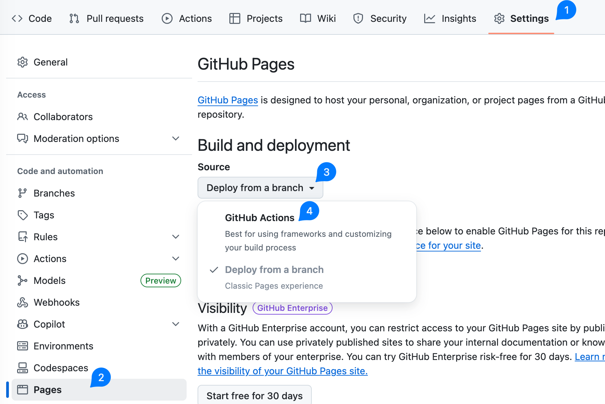
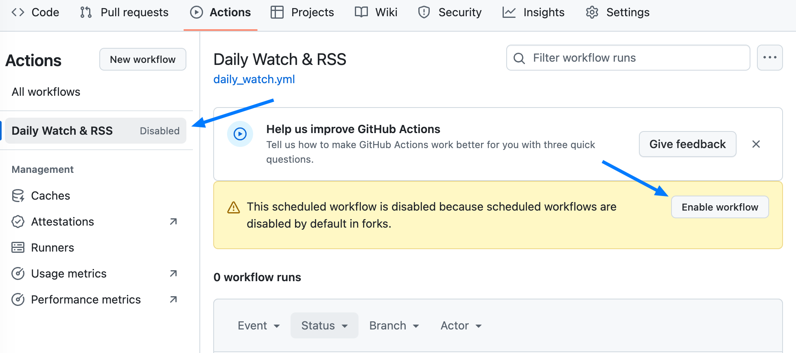
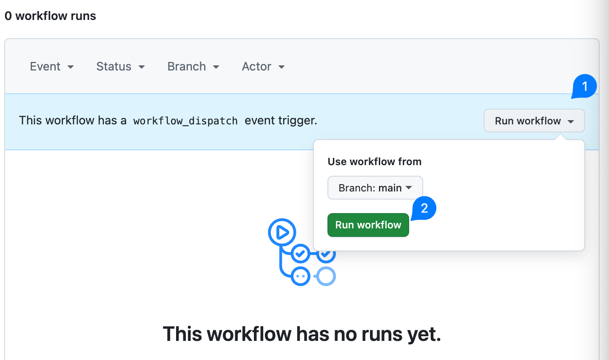
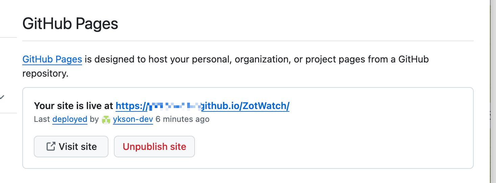
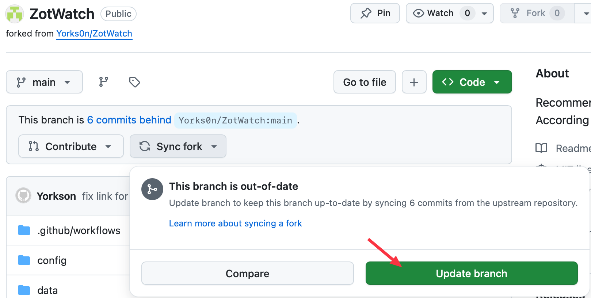

# ZotWatcher

ZotWatcher is a workflow that builds a personal interest profile from Zotero data and continuously monitors academic sources for newly published literature recommendations. It runs daily on GitHub Actions, generates RSS/HTML reports for the latest candidate papers, and can also be executed manually on a local machine when needed.

## Overview
- **Zotero sync**: Fetches library items through the Zotero Web API and incrementally updates the local profile.
- **Profile building**: Vectorizes library items, extracts high-frequency authors and journals, and tracks recently active journals.
- **Candidate collection**: Pulls data from sources such as Crossref, arXiv, and optionally bioRxiv/medRxiv, while also performing targeted retrieval for high-interest journals.
- **Deduplication and scoring**: Produces ranked recommendations by combining semantic similarity, time decay, citation/Altmetric signals, SJR journal metrics, and whitelist boosts.
- **Publishing outputs**: Generates `reports/feed.xml` for RSS subscription, publishes it through GitHub Pages, and can also generate HTML reports or push results back to Zotero.

## Quick Start

### v2 development: install the engine, use a separate workspace

E1 adds an installable entry point for Python 3.11+. Run the installation commands inside the ZotWatch checkout; no PyPI release is published:

```sh
python -m pip install .
# For development: python -m pip install -e .
zotwatch --help
zotwatch profile --workspace /path/to/personal-workspace --full
zotwatch watch --workspace /path/to/personal-workspace --rss --report
```

Keep the existing three YAML files in the personal workspace's `config/` directory and configure Zotero credentials in the environment or that workspace's `.env`. Copy and edit the original YAML examples when preparing a new workspace; installation does not provision personal configuration.

| Option | Default / behavior |
| --- | --- |
| `--workspace` | Current directory. The legacy `--base-dir` alias remains; both must resolve to the same directory when supplied together. |
| `--state-dir` | workspace/data; existing SQLite, FAISS, profile and cache formats. |
| `--reports-dir` | workspace/reports; existing RSS/HTML filenames. |
| `--journal-metrics` | legacy by default: workspace/data/journal_metrics.csv with unchanged missing-file handling. Use bundled explicitly for the original packaged CSV, or pass a CSV path. |

Relative state, report and CSV paths resolve against the workspace. `python -m src.cli profile|watch ...` remains available, also defaulting to the current directory; specify `--base-dir` when calling it elsewhere. Only workspace/.env is loaded, with existing environment values taking precedence.

E1 preserves ranking, synchronization, caching and default SJR behavior. Explicitly selecting bundled metrics can change scores for a workspace that previously had no metrics. The original fork/Actions setup follows below.

### E2 development: validate `zotwatch.yaml`

E2 adds strict v2 configuration validation without connecting v2 configuration to recommendation execution yet. Validate an independent workspace offline with:

```sh
zotwatch config validate --workspace /path/to/personal-workspace
```

Ordinary `zotwatch.yaml` files contain no API keys, environment or GitHub Secret names, public Supabase keys, or engine references. AI defaults to disabled, so the minimum configuration is valid without any AI credential. Presets and the two defined Custom generation protocols can pass schema and semantic validation, but E2 has no network adapters. A valid configuration does not mean its AI features are executable, and a future standard UI must hide providers whose adapters are not implemented.

Custom `connection_id` accepts only the engine-assigned `custom-1` through `custom-4`. The registry maps these IDs statically to four declared credential slots. The standard UI does not show the IDs, configuration cannot name a slot/environment/Secret, and a personal runner does not depend on a Cloudflare/D1 mapping. Validation output, reports, and artifacts do not contain Custom endpoints or keys.

In E2, `zotwatch profile|watch` continues to execute only the three-file legacy configuration. A v2-only workspace returns `CONFIG_V2_EXECUTION_DEFERRED`. The `python -m src.cli` compatibility entry point and its 1.x behavior remain unchanged. The v2 boundary obtains the public candidate connection from an engine-owned package resource; legacy/self-hosted endpoint and key overrides remain confined to the legacy adapter.

1. Sign in to GitHub and open the repository page: [ZotWatch](https://github.com/Yorks0n/ZotWatch)

2. Click the **Fork** button at the top to create your own copy under your GitHub account: **Fork - Create fork**

3. In your forked ZotWatch repository, open **Settings**. In the left sidebar, expand **Secrets and variables** and click **Action**.
   

4. Click the **New repository secret** button on the right and add the required repository secrets.
   

5. Add the following key-value pairs:

   - `ZOTERO_API_KEY`: Required to access your Zotero library data. Log in to your Zotero account at the [account settings page](https://www.zotero.org/settings/), then go to **Settings - Security - Applications** and click **Create new private key**. Enable **Allow library access** for Personal Library, set **Default Group Permissions** to **Read Only**, and save to get the API key.
   - `ZOTERO_USER_ID`: This ID can be found on the line below the **Create new private key** button in **Settings - Security - Applications**, which reads `User ID: Your user ID for use in API calls is ******`.
   - `OPENALEX_MAILTO`: An email address used as a polite identifier for some API requests.
   - `CROSSREF_MAILTO`: An email address used as a polite identifier for some API requests.
     

6. Return to your repository homepage, click **Settings**, then select **Pages** from the left sidebar. Set **Source** to **GitHub Actions** so the generated RSS page can be published directly through GitHub Pages.

   

7. Next, click the **Actions** tab at the top and make sure GitHub Actions is enabled.
   

8. Click **Daily Watch & RSS** on the left. By default, workflows in a forked repository are disabled, so click **Enable workflow** on the right to activate it.
   

9. The repository should then run automatically every day at 6:00 AM. To run it immediately, click **Run workflow**. The first run performs a full vector database build, so it may take some time. You can check the status under **All workflows**.

   

10. After the workflow finishes, go to **Settings - Pages** to find your site URL. Opening that URL directly will not show the RSS feed. Copy the URL and append `/feed.xml` to the end, for example: `https://[username].github.io/ZotWatch/feed.xml`. This URL can be imported into Zotero RSS subscriptions or any RSS reader you prefer.
    

11. The upstream repository of this project is regularly updated to fix bugs and optimize performance. Therefore, if you see an update notification, you can click **Update branch** at the top to update to the latest version.
   

## Run Locally
1. **Clone the repository and prepare the environment**
   ```bash
   git clone <your-repo-url>
   cd ZotWatcher
   mamba env create -n ZotWatcher --file requirements.txt  # or install with pip
   conda activate ZotWatcher
   ```

2. **Configure environment variables**
   Create a `.env` file in the repository root, or use GitHub Secrets. At minimum, include:
   - `ZOTERO_API_KEY`: Zotero Web API access key
   - `ZOTERO_USER_ID`: Zotero user ID (numeric)
   Optional:
   - `ALTMETRIC_KEY`: Used to fetch Altmetric data
   - `OPENALEX_MAILTO` / `CROSSREF_MAILTO`: Override the default contact email for monitoring requests

3. **Run locally**
   ```bash
   # Initial full profile build
   python -m src.cli profile --full

   # Daily watch run (generate RSS + HTML)
   python -m src.cli watch --rss --report --top 20
   ```

## Project Structure
```text
├─ src/                   # Main workflow modules
├─ config/                # YAML configuration, including APIs and scoring weights
├─ data/                  # Profile/cache/metric files (not version controlled)
├─ reports/               # Generated RSS/HTML outputs
└─ .github/workflows/     # GitHub Actions configuration
```

## Custom Configuration
- `config/zotero.yaml`: Zotero API settings (`user_id` may be written as `${ZOTERO_USER_ID}` and injected through `.env` or GitHub Secrets).
- `config/sources.yaml`: Data source toggles, categories, and time windows (default: 7 days).
- `config/scoring.yaml`: Weights for similarity, journal quality, and related factors, with support for manual whitelists.

## FAQ
- **Cache is stale**: Candidate lists are cached for 12 hours by default. Delete `data/cache/candidate_cache.json` to force a refresh.
- **No targeted retrieval for active journals**: Make sure `profile --full` has been run so that `data/profile.json` is generated.
- **No recommendations returned**: Check whether all candidates fall outside the 7-day window, or whether the preprint ratio limit is too strict. You can adjust `--top`, the day threshold in `_filter_recent`, or `max_ratio`.

## License
This project is licensed under the [MIT License](LICENSE).
